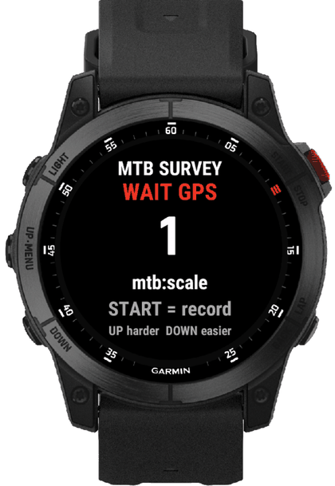
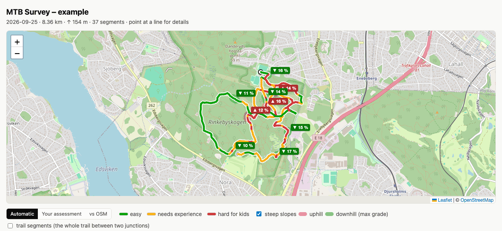
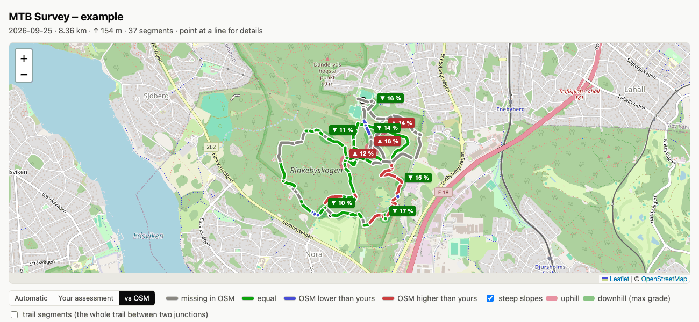
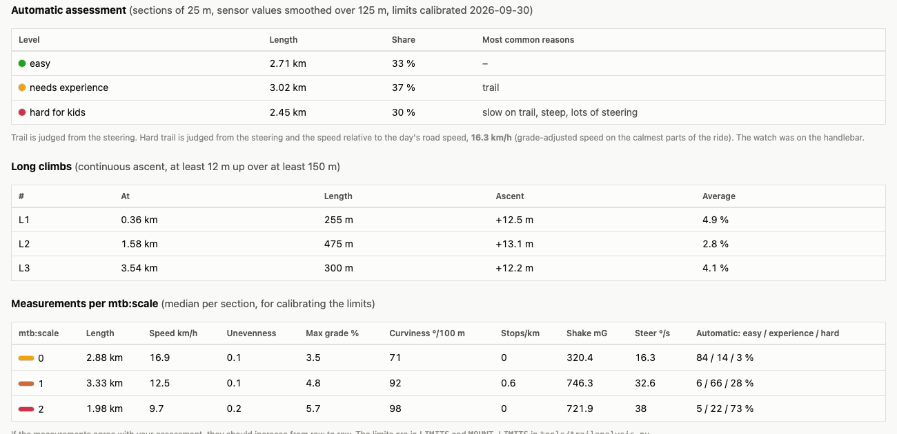

# MTB Survey for Garmin Epix Gen 2

MTB Survey maps how difficult trails are while you ride them. You set the difficulty with the watch
buttons, and at the same time the watch measures shaking and steering movements. Afterwards the ride
becomes a map where the trails are colored by your assessment and by an automatic assessment. From
there you can write the `mtb:scale` tag directly to OpenStreetMap.

<p align="center">
  
</p>



The project has two parts:

- **The watch app** in `source/`. A Connect IQ app that records a normal cycling activity and writes
  the difficulty and the sensor values to the FIT file, every second.
- **The analysis tools** in `tools/`. Python scripts without external packages that read the FIT file,
  assess the trails and make the map.

```
watch ──FIT file──▶ fitmap.py ──▶ map (HTML) and GeoJSON ──▶ mtb:scale in OpenStreetMap
                        │
                        ├─ trailanalysis.py   automatic assessment per 25 m
                        └─ trailsegments.py   trails between junctions, from OpenStreetMap
```

## Requirements

| For | You need |
|---|---|
| The watch app | Garmin Epix Gen 2 and [Connect IQ SDK](https://developer.garmin.com/connect-iq/sdk/) 9.2 or later, with your own developer key |
| The analysis tools | Python 3.9 or later. No packages needed. |
| The map | A web browser with internet access, for the map tiles |
| Trail segments | Internet access the first time, for the OpenStreetMap Overpass API. The response is then cached locally. |
| The tests of OSM writing | Node 18 or later |

The app is only built and tested for the Epix Gen 2 (`epix2`). Other watches with a gyroscope and
API level 3.3 should work if they are added to `manifest.xml`, but this has not been tested.

## Install on the watch

There are two ways: through the Connect IQ Store, or by copying the app directly to the watch over USB.

**The app is not publicly available in the Connect IQ Store.** It is currently a beta app on the
author's personal developer account, so only the author can download it. If you want to install it
through the store, you have to upload it yourself to your own developer account. Copying it over USB
is the easiest way.

### Build

1. Install the [Connect IQ SDK](https://developer.garmin.com/connect-iq/sdk/) and create a developer key
   following Garmin's instructions, if you do not have one. Put it as `developer_key` in the project root.
   Git ignores the file.
2. Build the app:
   ```
   make build
   ```
   This runs `monkeyc -f monkey.jungle -d epix2 -o bin/mtbsurveyepixgen2.prg -y developer_key -r`.
   If the SDK is not in your `PATH`, give the path: `make build MONKEYC="/path/to/sdk/bin/monkeyc"`.
   In VS Code you can also use *Monkey C: Build for Device* and choose epix (Gen 2).

### Option 1: copy over USB (sideload)

1. Connect the watch with USB.
2. Copy `bin/mtbsurveyepixgen2.prg` to the folder `GARMIN/APPS/` on the watch.
3. Disconnect. The app is then listed among the watch's apps.

The app does not update automatically. Copy a new `.prg` to update it.

### Option 2: through the Connect IQ Store

1. Build the package for the store:
   ```
   make package
   ```
   This gives `bin/mtbsurvey.iq`, that is `monkeyc -e -f monkey.jungle -o bin/mtbsurvey.iq -y developer_key -r`.
   If you upload it under your own account, first change the app id in `manifest.xml`. The id must be
   unique in the store, and the current one is already used by the original app. You can create a new id with
   `uuidgen | tr -d '-' | tr 'A-Z' 'a-z'`.
2. Log in to Garmin's Connect IQ developer portal and upload `bin/mtbsurvey.iq` as a new app.
   Choose to publish it as a beta app if only you should be able to download it.
3. Install the app from the Connect IQ app on your phone, using the same Garmin account.

A beta app is only visible to the account that uploaded it. For others to install the app from the store,
it must be published publicly and reviewed by Garmin.

### After installing

Consider setting recording to every second in the watch's system settings, for the densest possible track.

After a ride the FIT file is in `GARMIN/Activity/` on the watch. You can also download it from
Garmin Connect with *Export Original*.

## Use in the field

| Button | Function | Vibration |
|---|---|---|
| START | Start, pause and resume recording | long on start and resume, short on pause |
| UP | Raise the difficulty one step, at most 6 | short |
| DOWN | Lower the difficulty one step, at least 0 | short |
| BACK | Stop, save the activity and exit, without confirmation | longest |

The screen shows the GPS status, the current difficulty in large digits, the recording status and, at the
bottom, the latest sensor values: `RGH` for shake (roughness) and `STR` for steering. If it says
`NO MOTION DATA`, no motion data is coming in. Wait for a green `GPS OK` before you start, otherwise the
start of the track has no position. The difficulty starts at 1.

**Put the watch on the handlebar.** The automatic assessment is most accurate there, and the values
stay the same from day to day. On the wrist it works less well, see [the assessment](docs/assessment.md).

**You choose which scale to use.** The app only stores the number. If you write to
OpenStreetMap, it should follow [`mtb:scale`](https://wiki.openstreetmap.org/wiki/Key:mtb:scale).
The automatic assessment is calibrated for a simpler scale with three levels:
0 = gravel road or asphalt, 1 = child-friendly trail, 2 = trail that is not child-friendly.

**Mark places.** A quick UP followed by DOWN shows up as a short peak in the FIT file.
You can use it to mark, for example, the start and end of a loop.

## Analyze a ride

Run all commands from the project root.

**Map**, the most common:
```
python3 tools/fitmap.py ride.fit [outdir]
```
Writes a standalone HTML map and GeoJSON files next to the FIT file, or in `outdir`.
The map shows the track colored by your assessment or the automatic one, an elevation profile, steep
slopes, trail segments between junctions and a comparison with `mtb:scale` in OpenStreetMap.
See [the map page](docs/map-page.md).

| Flag | Meaning |
|---|---|
| `--site dir` | Also writes a folder for a web host, which works under a strict Content Security Policy |
| `--no-osm` | Skips the trail segments, so no request to OpenStreetMap |
| `--mount wrist` or `--mount handlebar` | Sets where the watch was mounted. Otherwise it is detected from the heart rate. |
| `--osm-client-id ID` | Enables writing `mtb:scale` to OpenStreetMap from the map page |
| `--osm-api URL` | Another OSM server, for example the test server |

**Automatic assessment** in the terminal:
```
python3 tools/trailanalysis.py ride.fit [--mount wrist|handlebar]
```

**Decode the FIT file**, to inspect it:
```
python3 tools/fitdump.py ride.fit
```
The last line sums up how many records have a position, a difficulty and sensor values.

## Example

The example map [docs/example/map.html](docs/example/map.html) is made from 8 km of a ride with
a manual assessment. Download the file and open it in a web browser. The start and end of the ride are cut off.

The same ride with your own assessment instead of the automatic one, and with the elevation profile below the map:


Comparison with the `mtb:scale` that already exists in OpenStreetMap. Gray means missing in OSM, green equal,
blue means OSM has a lower value and red a higher one:



Below the map there are tables with the automatic assessment and the measurements per level,
followed by one row per trail in OpenStreetMap:



## Documentation

| Document | Contents |
|---|---|
| [docs/map-page.md](docs/map-page.md) | The map, the trail segments, the comparison with OSM and writing to OSM |
| [docs/assessment.md](docs/assessment.md) | How the automatic assessment works, how it was calibrated and how accurate it is |
| [docs/fit-fields.md](docs/fit-fields.md) | The fields the app writes to the FIT file, and how to read them |
| [docs/implementation.md](docs/implementation.md) | How the watch app works inside |
| [docs/verification.md](docs/verification.md) | What has been tested on the watch, in the simulator and with tests |
| [CHANGELOG.md](CHANGELOG.md) | Changes per version |
| [CONTRIBUTING.md](CONTRIBUTING.md) | How to contribute |

## Project structure

```
manifest.xml, monkey.jungle   the Connect IQ project
source/                       the watch app (Monkey C)
test/                         unit tests for the sensor calculation (Monkey C)
resources/                    the app's name and icon
tools/
  fitdump.py                  FIT decoder without dependencies
  fitmap.py                   map, elevation profile and web host folder
  trailanalysis.py            automatic assessment; the limits are at the top
  trailsegments.py            trail segments and comparison with OpenStreetMap
  osmedit.js                  tag change in OSM way XML, used by the map page
  leaflet/                    Leaflet 1.9.4 for the web host folder
  test_*.py, test_osmedit.js  tests
docs/                         documentation, screenshots and example map
```

## Tests

```
make test          # Python and Node tests for the analysis tools
make test-watch    # the watch app's unit tests in the Connect IQ simulator (start the simulator first)
```

GitHub Actions also runs the Python and Node tests on every push.

## Privacy

FIT files, maps and GeoJSON files contain your GPS positions, and rides often start at home.
Only share them with people who may see where you have been. `.gitignore` keeps them out of git.
If you write to OpenStreetMap, only the `mtb:scale` tag on the trail becomes public, not your track.
The example map and the screenshots in `docs/` show part of a real ride, with the start and end cut off.

## Known limitations

- Garmin Connect does not show developer fields from sideloaded apps. The values are still in the FIT file.
- BACK saves and exits immediately, without confirmation.
- The automatic assessment is calibrated against a single manually assessed ride. It has not been tested
  with other riders, bikes or trail types.
- With the watch on the wrist, the limit between road and trail is preliminary and does not hold every day.

## License

[MIT](LICENSE). Leaflet in `tools/leaflet/` has its own license, BSD 2-Clause.
Map data and trails from OpenStreetMap, also in the example map, are covered by the [ODbL](https://www.openstreetmap.org/copyright).
