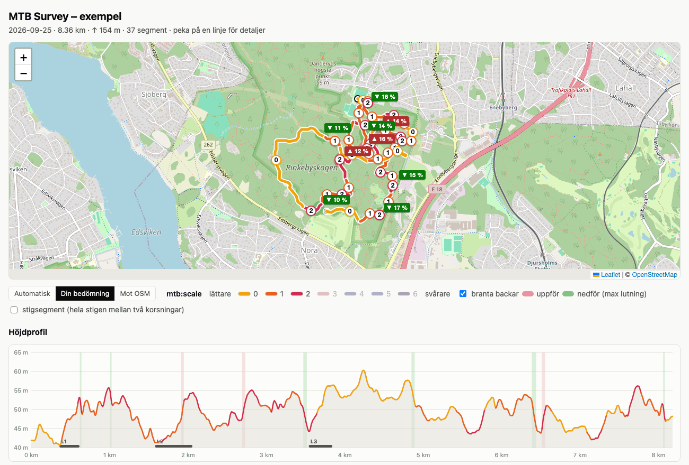
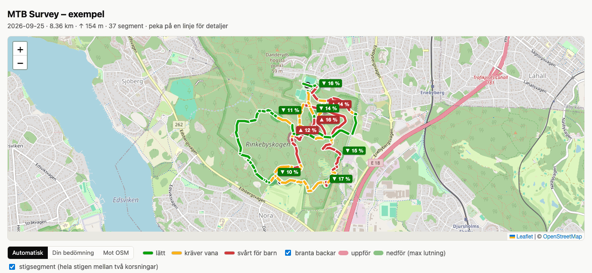

# Kartsidan

`tools/fitmap.py` gör en fristående HTML-karta av en FIT-fil. Den här sidan beskriver vad kartan visar.
Kommandona finns i [README](../README.md#analysera-en-tur).

## Karta, höjdprofil och branta backar



Spåret delas i segment där `mtb_scale` är konstant, och bryts även vid paus.
Verktyget skriver två filer bredvid FIT-filen, eller i utmappen:
- en fristående HTML-karta med färgkodade linjer, siffra på varje segment, teckenförklaring och tabell. Den hämtar kartbilder från OpenStreetMap och kräver internet.
- en GeoJSON-fil med ett linjeobjekt per segment och egenskapen `mtb:scale`. Den går att öppna som lager i JOSM eller QGIS.

Om FIT-filen har höjd (`enhanced_altitude`) får HTML-kartan också:
- en höjdprofil under kartan. Kurvan är färgad efter `mtb_scale`. Hovra i profilen så visas samma punkt på kartan, och klicka så flyttas kartan dit.
- branta backar, alltså partier med minst 8 % lutning över minst 20 m och minst 3 m höjdskillnad. De visas som en färgad halo på kartan, röd uppför och grön nedför i färdriktningen, med etiketten `▲/▼ max %`, som band i samma färger i profilen och i en egen tabell. Lutningen står i tooltipen. Gränserna ändras i `MIN_GRADE`, `MIN_LEN_M` och `MIN_DH_M` överst i `tools/fitmap.py`.

Lutningen räknas på höjden omsamplad var 5:e meter och utjämnad över cirka 25 m. Enstaka höga toppvärden på korta partier jämnas alltså ut.

Båda filerna innehåller dina GPS-positioner.

## Stigsegment



Kryssrutan **stigsegment** ovanför kartan färgar hela stigen mellan två korsningar med ett
sammanvägt värde, i stället för spåret bit för bit. Det gäller i båda lägena: din bedömning
ger `mtb:scale`, automatiken ger nivån. Etiketterna med siffror visas från zoomnivå 16.
Adressen `...html#trails` slår på läget direkt, och `#trails,manual` med din bedömning.

Så räknas det, i `tools/trailsegments.py`:

1. Stignätet i spårets område hämtas från OpenStreetMap via Overpass (`highway=path`, `track`,
   `footway`, `cycleway` och vanliga vägar). Svaret cachas som `osm_<hash>.json` i utmappen,
   så nästa körning på samma område går utan internet. `--no-osm` hoppar över steget helt.
2. Varje OSM-way delas vid noder som ingår i fler än en way, alltså korsningar.
3. Varje profilpunkt (var 5:e meter) matchas till närmaste segment inom `MATCH_M` = 25 m.
   Byten kortare än 15 m slätas ut. Partier utan väg inom 25 m blir egna segment (`u1`, `u2` ...)
   med spårets egen geometri.
   En matchning godtas bara om spåret följer segmentet minst halva dess längd eller 50 m
   (`MIN_COVER_FRAC`, `MIN_RUN_M`), med 5 m marginal för samplingen. Annars går punkterna till
   grannsegmentet. Stigar som bara korsas, eller grenar som löper nära spåret de första metrarna
   efter en korsning, ritas alltså inte som cyklade. Spårets första och sista del behålls alltid.
4. Segmentets värde är det **högsta** värde som förekommer sammanhängande under minst
   `MIN_RUN_M` = 50 m, räknat över alla pass på segmentet. För kortare segment gäller halva
   den cyklade längden som gräns. Når inget värde gränsen vinner det med flest meter.
   En enstaka brusig 25 m-sektion slår alltså inte om ett helt segment.

Segmenten numreras i den ordning de först cyklades. Tabellen *Stigsegment* listar varje cyklat segment med länk till OSM-wayen, ditt och det
automatiska värdet med de meter som motiverar det, och det `mtb:scale` som redan finns i OSM.
Klick på en rad zoomar dit. Filen `<namn>_stigsegment.geojson` innehåller samma sak som lager
för JOSM.

### Jämförelse med OSM

Knappen **Mot OSM** ovanför kartan färgar stigsegmenten efter hur ditt värde förhåller sig till
taggen `mtb:scale` som redan finns i OSM, siffra mot siffra: grå saknas i OSM, grön lika,
blå OSM lägre än du, röd OSM högre än du. Adressen `...html#osm` öppnar läget direkt.

Tabellen *Jämförelse med OSM* har en rad per cyklad OSM-way, med OSM:s värde, ditt sammanvägda
värde för hela wayen (samma 50 m-regel, räknat över alla delar), det automatiska värdet, avvikelsen
och taggarna `surface`, `smoothness` och `trail_visibility` om de finns. Avvikelser sorteras först.
Sidan använder hela fönsterbredden. Kartan och lägesraden ligger fast upptill medan resten av sidan
scrollar under, så tabellen och kartan syns samtidigt. Tabellernas rubrikrad fäster under kartan
(på skärmar smalare än 960 px scrollar tabellerna i sidled i stället). Hovra på en rad så markeras wayens delar på kartan, och hovra på ett segment på kartan
så markeras dess rader och scrollas i sikte.
**Dela** betyder att du gett olika värden åt olika delar mellan korsningarna, så wayen bör delas i
OSM innan den taggas. Raderna ligger i den ordning wayerna cyklades. Ways med flera delar har en pil
som fäller ut eller ihop delarna som indragna rader. Delar med avvikelse visas från start, övriga är
ihopfällda, och länkarna *visa alla delar* och *dölj alla delar* gäller hela tabellen.
Klick på en rad visar wayen.

### Skriva mtb:scale till OSM från kartsidan

Generera kartan med `--osm-client-id <id>` så får OSM-tabellen kolumnen *Skriv till OSM* och en
inloggningsknapp. Inloggningen är OAuth 2 med PKCE direkt mot osm.org, utan hemlighet på sidan.
Tokenen ligger i webbläsarens sessionStorage och försvinner när fliken stängs.

Förberedelse, en gång: registrera en OAuth 2-applikation på osm.org under *Mina inställningar,
OAuth 2-applikationer*. Rättigheter `write_api` och `read_prefs`, rutan *Konfidentiell* avbockad, och
redirect-adresserna exakt lika med kartsidans adress, till exempel `https://din-adress/mtb/index.html`,
samt `http://127.0.0.1:8767/index.html` för lokal test. Client-id:t hamnar i sidan.

Kolumnen *Skriv till OSM* har knapparna *0 1 2 3* på rader som är path, track, footway eller bridleway.
Du väljer själv värdet. Ditt eget värde har fet ram, och värdet som redan finns i OSM är mörkt ifyllt och
går inte att välja. Har OSM ett annat värde, till exempel `2+` eller `4`, står det som text före knapparna.
Tagga inte en way märkt *dela* förrän den är delad. Första trycket blir *Bekräfta*, andra trycket skriver:
ett changeset öppnas med kommentaren *mtb:scale från fältkartering med cykel*, wayens aktuella version
hämtas, taggen byts, wayen laddas upp och changesetet stängs. Det automatiska värdet skrivs aldrig. Har `mtb:scale` i OSM ändrats sedan Overpass-svaret hämtades stoppar sidan i stället för
att skriva över. Efter lyckad skrivning visas det skrivna värdet med länk till changesetet.
När sidan laddas hämtas aktuellt `mtb:scale` för alla cyklade ways direkt från OSM:s API, utan inloggning.
Taggningar som gjorts efter att kartan genererades syns därför efter en omladdning. Raden ovanför tabellen
säger hur många värden som ändrats. Går OSM inte att nå visas värdena från genereringen, med en notering.
Overpass-svaret i `osm_<hash>.json` används däremot igen vid nästa generering, så GeoJSON-filen för JOSM
har de gamla värdena tills du tar bort cachefilen.

Testa gärna först mot OSM:s testserver: registrera en app på `https://master.apis.dev.openstreetmap.org`
och generera med `--osm-api https://master.apis.dev.openstreetmap.org`.

Behåller du en Content Security Policy på mappen behöver den `connect-src` för osm.org.
Taggbytet i way-XML ligger i `tools/osmedit.js` och testas med `node tools/test_osmedit.js`.

I `_stigsegment.geojson` finns samma sak per del: `diff`, `diff_auto`, `way_mtb_scale`, `way_split`
och `osm_surface` med flera.

Begränsningar: parallella stigar närmare varandra än 25 m kan förväxlas, och stigar som saknas i OSM
får bara spårets egen geometri. Överdriven uppdelning i tätt kartlagda områden är väntad, eftersom
varje gångvägskorsning bryter segmentet.

## För webbhotell

```
python3 tools/fitmap.py aktivitet.fit [utmapp] --site webbmapp
```
skriver dessutom en mapp med `index.html`, `style.css`, `app.js`, GeoJSON-filen och `leaflet/` lokalt.
Ingen css eller js är inbäddad och inga `style`-attribut används, så sidan fungerar under en strikt
Content Security Policy (`style-src 'self'; script-src 'self'`), vilket många webbhotell sätter.
Ladda upp hela mappen. Kartbilderna hämtas fortfarande från OpenStreetMap.
