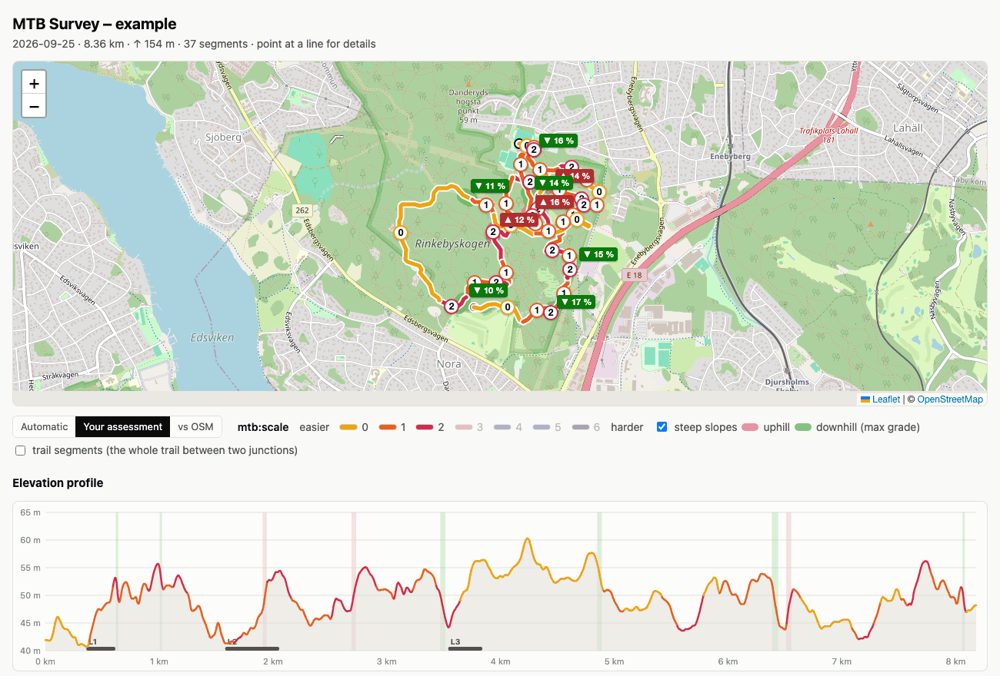
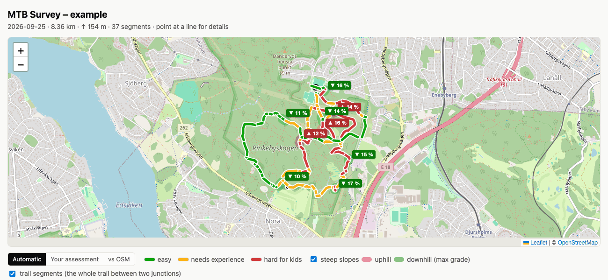

# The map page

`tools/fitmap.py` makes a standalone HTML map from a FIT file. This page describes what the map shows.
The commands are in the [README](../README.md#analyze-a-ride).

## Map, elevation profile and steep slopes



The track is split into segments where `mtb_scale` is constant, and it is also broken at pauses.
The tool writes two files next to the FIT file, or in the output folder:
- a standalone HTML map with color-coded lines, a number on each segment, a legend and a table. It loads map tiles from OpenStreetMap and needs internet access.
- a GeoJSON file with one line feature per segment and the property `mtb:scale`. It can be opened as a layer in JOSM or QGIS.

If the FIT file has altitude (`enhanced_altitude`), the HTML map also gets:
- an elevation profile below the map. The curve is colored by `mtb_scale`. Hover over the profile to see the same point on the map, and click to move the map there.
- steep slopes, that is stretches with a grade of at least 8 % over at least 20 m and at least 3 m of elevation difference. They are shown as a colored halo on the map, red uphill and green downhill in the direction of travel, with the label `▲/▼ max %`, as bands in the same colors in the profile, and in a table of their own. The grade is shown in the tooltip. Change the limits in `MIN_GRADE`, `MIN_LEN_M` and `MIN_DH_M` at the top of `tools/fitmap.py`.

The grade is computed on the altitude resampled every 5 meters and smoothed over about 25 m. So single high peak values on short stretches are smoothed out.

Both files contain your GPS positions.

## Trail segments



The **trail segments** checkbox above the map colors the whole trail between two junctions with a
combined value, instead of the track piece by piece. This applies in both modes: your assessment
gives `mtb:scale`, the automatic assessment gives the level. The number labels are shown from zoom level 16.
The address `...html#trails` turns the mode on directly, and `#trails,manual` does so with your assessment.

This is how it is computed, in `tools/trailsegments.py`:

1. The trail network in the track's area is fetched from OpenStreetMap via Overpass (`highway=path`, `track`,
   `footway`, `cycleway` and ordinary roads). The response is cached as `osm_<hash>.json` in the output folder,
   so the next run on the same area works without internet access. `--no-osm` skips this step entirely.
2. Each OSM way is split at nodes that are part of more than one way, that is junctions.
3. Each profile point (every 5 meters) is matched to the nearest segment within `MATCH_M` = 25 m.
   Switches shorter than 15 m are smoothed out. Stretches without a road within 25 m become their own segments (`u1`, `u2` ...)
   with the track's own geometry.
   A match is only accepted if the track follows the segment for at least half its length or 50 m
   (`MIN_COVER_FRAC`, `MIN_RUN_M`), with a 5 m margin for the sampling. Otherwise the points go to the
   neighboring segment. Trails that are only crossed, or branches that run close to the track for the first meters
   after a junction, are therefore not drawn as ridden. The first and last parts of the track are always kept.
4. The segment's value is the **highest** value that occurs continuously over at least
   `MIN_RUN_M` = 50 m, counted over all rides on the segment. For shorter segments, half
   the ridden length is the limit. If no value reaches the limit, the one with the most meters wins.
   So a single noisy 25 m section does not flip a whole segment.

The segments are numbered in the order they were first ridden. The *Trail segments* table lists each ridden segment with a link to the OSM way, your value and the
automatic value with the meters that justify it, and the `mtb:scale` that already exists in OSM.
Clicking a row zooms there. The file `<name>_trails.geojson` contains the same thing as a layer
for JOSM.

### Comparison with OSM

The **vs OSM** button above the map colors the trail segments by how your value compares with
the `mtb:scale` tag that already exists in OSM, number against number: gray missing in OSM, green equal,
blue OSM lower than you, red OSM higher than you. The address `...html#osm` opens the mode directly.

The *Comparison with OSM* table has one row per ridden OSM way, with the OSM value, your combined
value for the whole way (the same 50 m rule, counted over all parts), the automatic value, the difference
and the tags `surface`, `smoothness` and `trail_visibility` if they exist. Differences are sorted first.
The page uses the full window width. The map and the mode bar stay fixed at the top while the rest of the page
scrolls underneath, so the table and the map are visible at the same time. The table header rows stick below the map
(on screens narrower than 960 px, the tables scroll sideways instead). Hover over a row to highlight the way's parts on the map, and hover over a segment on the map
to highlight its rows and scroll them into view.
**Split** means that you have given different values to different parts between the junctions, so the way should be split in
OSM before it is tagged. The rows are in the order the ways were ridden. Ways with several parts have an arrow
that expands or collapses the parts as indented rows. Parts with a difference are shown from the start, the others are
collapsed, and the links *show all parts* and *hide all parts* apply to the whole table.
Clicking a row shows the way.

### Writing mtb:scale to OSM from the map page

Generate the map with `--osm-client-id <id>` and the OSM table gets the column *Write to OSM* and a
login button. The login is OAuth 2 with PKCE directly against osm.org, with no secret in the page.
The token is kept in the browser's sessionStorage and disappears when the tab is closed.

Preparation, once: register an OAuth 2 application on osm.org under *My Settings,
OAuth 2 applications*. Permissions `write_api` and `read_prefs`, the *Confidential* box unchecked, and
the redirect URLs exactly equal to the map page's address, for example `https://your-address/mtb/index.html`,
plus `http://127.0.0.1:8767/index.html` for local testing. The client id ends up in the page.

The *Write to OSM* column has the buttons *0 1 2 3* on rows that are path, track, footway or bridleway.
You choose the value yourself. Your own value has a bold border, and the value that already exists in OSM is filled in dark and
cannot be selected. If OSM has another value, for example `2+` or `4`, it is shown as text before the buttons.
Do not tag a way marked *split* until it has been split. The first press becomes *Confirm*, the second press writes:
a changeset is opened with the comment *mtb:scale from field survey by bike*, the way's current version
is fetched, the tag is changed, the way is uploaded and the changeset is closed. The automatic value is never written. If `mtb:scale` in OSM has changed since the Overpass response was fetched, the page stops instead of
overwriting it. After a successful write, the written value is shown with a link to the changeset.
When the page loads, the current `mtb:scale` for all ridden ways is fetched directly from the OSM API, without logging in.
Tags added after the map was generated are therefore shown after a reload. The line above the table
says how many values have changed. If OSM cannot be reached, the values from the generation are shown, with a note.
The Overpass response in `osm_<hash>.json`, however, is reused at the next generation, so the GeoJSON file for JOSM
has the old values until you delete the cache file.

Consider testing against the OSM test server first: register an app on `https://master.apis.dev.openstreetmap.org`
and generate with `--osm-api https://master.apis.dev.openstreetmap.org`.

If you keep a Content Security Policy on the folder, it needs `connect-src` for osm.org.
The tag change in the way XML is in `tools/osmedit.js` and is tested with `node tools/test_osmedit.js`.

`_trails.geojson` contains the same thing per part: `diff`, `diff_auto`, `way_mtb_scale`, `way_split`,
`osm_surface` and more.

Limitations: parallel trails closer to each other than 25 m can be confused, and trails missing from OSM
only get the track's own geometry. Excessive splitting in densely mapped areas is expected, since
every footpath junction breaks the segment.

## For a web host

```
python3 tools/fitmap.py activity.fit [outdir] --site webdir
```
also writes a folder with `index.html`, `style.css`, `app.js`, the GeoJSON file and `leaflet/` locally.
No CSS or JS is inlined and no `style` attributes are used, so the page works under a strict
Content Security Policy (`style-src 'self'; script-src 'self'`), which many web hosts set.
Upload the whole folder. The map tiles are still loaded from OpenStreetMap.
